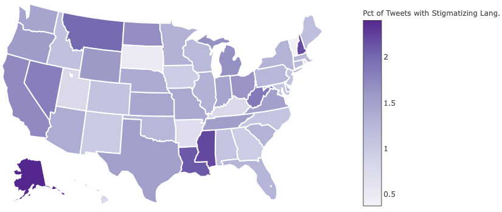

# Measuring Opioid-Related Stigma using NLP
## Udacity Machine Learning Engineer Nanodegree Capstone Project

This repository contains code and write-ups related to measuring opioid-related
stigma using natural language processing tools. This project was
submitted as my capstone project for the May 2018 Term of Udacity's Machine
Learning Engineer Nanodegree.

### Project Overview

In 2016, [42,249 Americans](https://www.cdc.gov/mmwr/volumes/67/wr/mm6712a1.htm) died as a result of an opioid overdose. To put
that in perspective, that is more than the [number of deaths in 2016](https://www.cdc.gov/nchs/data/nvsr/nvsr67/nvsr67_05.pdf) caused
by firearms (38,658) or motor vehicle crashes (38,748). The epidemic has
struck small towns and big cities; families struggling to make ends meet and
families that seem like they're living the American dream. Certain parts of the
country have been hit especially hard, including my native Kentucky.

The most effective known method for reducing overdose deaths is providing
medication for addiction treatment (MAT) which has been shown in 
[clinical studies](https://www.bmj.com/content/357/bmj.j1550) to cut overdose
deaths by 70 percent. However, the persistence of [stigmatized views](https://jamanetwork.com/journals/jama/article-abstract/1838170)
of addiction as a moral failing rather than a medical condition among
policymakers and the general public has fueled resistance to efforts to expand
access to MAT and discouraged individuals struggling with addiction from seeking treatment.

Despite its importance, very little data is currently available on
opioid-related stigma. To fill this gap, this project uses a novel dataset of
149,000 opioid-related conversations scraped from Twitter between March and
September 2018. To create labeled examples, 1,000 randomly selected tweets are
manually coded for stigmatizing language. These examples are then used to train
a Naïve Bayes classifier that automatically codes the remaining tweets to
produce the first proxy measure of how opioid-related stigma varies across the United States.

### Percent of Tweets Containing Stigmatizing Language by State

### Replication
- All libraries needed for replication are listed in
`environment/environment.yml`.
- All data needed for replication (145 MB) can be downloaded from this 
[Dropbox link](https://www.dropbox.com/sh/9sfeo5p05dqxpb4/AACK0aako88H-G3s3nmmcE11a?dl=0).
- All code needed for replication is contained in
`code/opioid-stigma-nlp.ipynb`.
- Figures included in the report are in `figures/`.
