# Definition

## Project Overview

In 2016, 42,249 Americans died as a result of an opioid overdose [1]. To put
that in perspective, that is more than the number of deaths in 2016 caused by
firearms (38,658) or motor vehicle crashes (38,748) [2]. The epidemic has
struck small towns and big cities; families struggling to make ends meet and
families that seem like they're living the American dream. Certain parts of the
country have been hit especially hard, including my native Kentucky.

The most effective known method for reducing overdose deaths is providing
medication for addiction treatment (MAT) which has been shown in clinical
studies to cut overdose deaths by 70 percent [3]. However, the persistence of
stigmatized views of addiction as a moral failing rather than a medical
condition among policymakers and the general public has fueled resistance to
efforts to expand access to MAT and discouraged individuals struggling with
addiction from seeking treatment [4].

Despite its importance, very little data is currently available on
opioid-related stigma. In particular, although there have been nationally
representative surveys that asked about opioid related stigma [5], there is no
data on how stigma varies across the United States—an important gap given the
significant geographic variation of the epidemic. To fill this gap, I have
gathered data on opioid-related conversations using Twitter's Streaming API
and analyzed these conversations for stigmatizing language using natural
language processing tools.

## Problem Statement

The goal of this project is to measure how opioid-related stigma varies across
the United States. To do so, I have tracked and analyze opioid-related
conversations on Twitter. Analyzing tweets to determine whether they perpetuate
a stigmatized view of opioid-use disorder represents a sentiment analysis
problem, which is a subset of natural language processing problems. Although
many sentiment analysis tools have been created in recent years, most of these
tools focus on analyzing the positivity/negativity of text data. In this
project, I develop a supervised method for coding the text of tweets for
opioid-related stigma. Since my target variable is whether or not a particular
tweet contains stigmatizing language, this is specifically a binary
classification task.

Measuring geographic variation in opioid-related stigma required completing the
following tasks:

1. Build a dataset using Twitter's Streaming API
2. Clean data to exclude duplicates, replies that do not contain opioid-related
keywords, and tweets from users without an identifiable location within the
U.S.
3. Manually code a sample of tweets to be used as training data
4. Prepare text for natural language processing by normalizing and vectorizing
5. Train and evaluate classifiers
6. Select a classifier and use it to automatically code the remaining tweets

As part of task 5, I will evaluate the following supervised learning
classifiers: Logistic Regression, Linear Support Vector Machine, Naïve Bayes,
AdaBoost, and a Convolutional Neural Network. I will select a classifier to use
for task 6 based on the evaluation metrics discussed in the next section. The
final classifier is expected to be able to predict with a high-degree of
accuracy whether a tweet contains language that perpetuates opioid-related
stigma.

## Evaluation Metrics

To quantify the performance of the benchmark model and the solution model, I
will use two metrics: accuracy and F-1 score.

- **Accuracy formula:** ```(TP + TN)/(TP + TN + FP + FN)```

- Accuracy measures the proportion of hand-coded values that are correctly
predicted. In the formula above, TP is the number of true positives, TN is the
number of true negatives, FP is the number of false positives, and FN is the
number of false negatives.

- **F-1 score formula:** ```(2 * precision * recall)/(precision + recall)```

- F-1 score takes the harmonic mean of precision and recall.
  - Precision tells us what proportion of tweets we classified as
    stigmatizing actually were stigmatizing. It is defined as `TP/(TP + FP)`.
  - Recall tells us what proportion of messages that actually were stigmatizing
  were classified by us as stigmatizing. It is defined as `TP/(TP + FN)`.

Accuracy is an appropriate initial metric for this binary classification task
since the goal is to correctly predict which tweets contain stigmatizing
language (true positives) and which tweets do not contain stigmatizing language
(true negatives) Ultimately, however, I will give less weight to accuracy and
than to F-1 score since I expect my data to by highly imbalanced. To see why
F-1 score is a more robust measure than accuracy when text data is highly
imbalanced, consider the case of a classifier for junk email when less than 10%
of email is junk. In this case just predicting that no email is junk would lead
to a more than 90% accuracy but a F-1 score of zero since both precision and
recall will be equal to zero because no true positives were identified.

# Analysis

## Data Exploration
Using Twitter's Streaming API, I have built a dataset of of 713,256 tweets that
contain opioid-related keywords (Table 1) which were tweeted between March 25,
2018 and September 22, 2018. Many tweets relate to opioid-related news articles
such as in Figure 1. However, some tweets clearly contain language that
perpetuates stigma by arguing that addiction is an individual choice and that
programs to reduce addiction are not good uses of public resources (Figure 2).

### Table 1: Opioid-Related Keywords Tracked via Twitter

**General**  **Harm-Reduction**    **Overdose**  **Medication**   **Prescription**  **Synthetic**
-----------  --------------------  ------------- ---------------  ----------------  -------------
heroin       injection site        overdose      burprenorphine   codine            carfentanil
narcotic     needle exchange       naloxone      methadone        hydrocodone       fentanyl
opiate       safe injection        narcan        naltrexone       morphine
opioid       supervised injection                suboxone         opana
opium                                            vivitrol         oxycodone
                                                                  oxycontin
                                                                  percocet
                                                                  vicodin

### Figure 1: Example Tweet Sharing Opioid-Related News Article
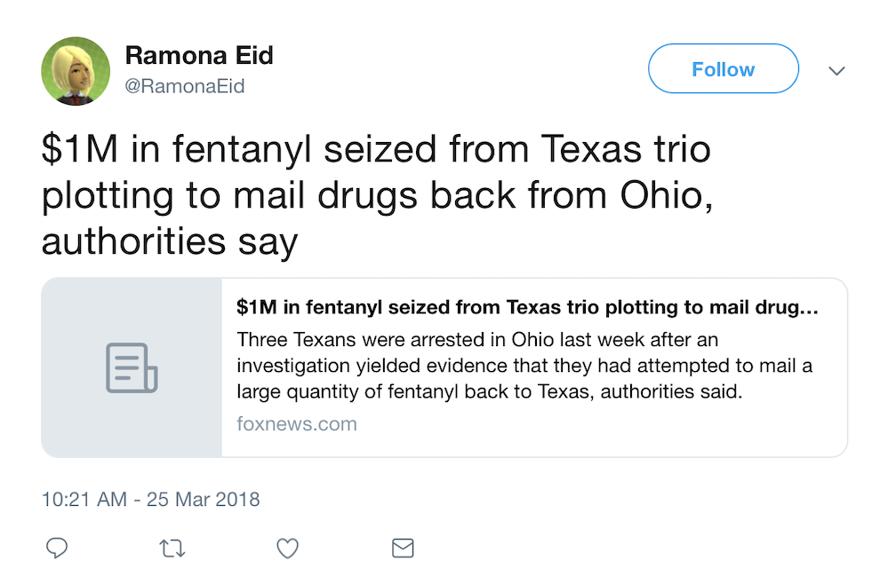


### Figure 2: Example Tweet Perpetuating Opioid-Related Stigma
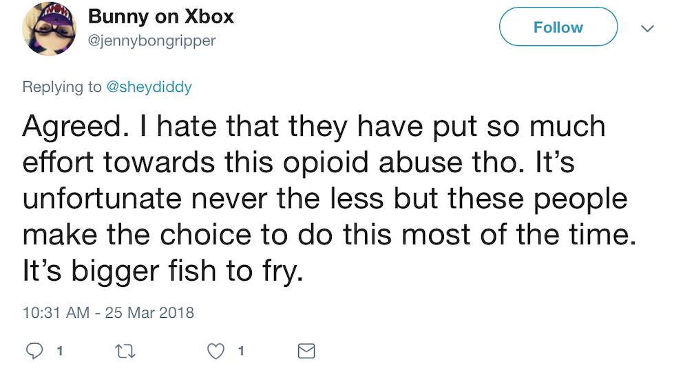

\newpage
To select the final sample and prepare the data for manual coding, a number of
cleaning steps were required. First, 324,776 tweets that did not contain
opioid-related keywords were dropped. These tweets were only captured by
the stream listener because they _quoted_ a tweet that included an
opioid-related keyword (Figure 3). Since the stream listener only captured the
URL of the quoted tweet but not its text, the tweet_text field for these quote
tweets does not contain any opioid-related keywords.

### Figure 3: Quote Tweet Missing Opioid-Related Keywords
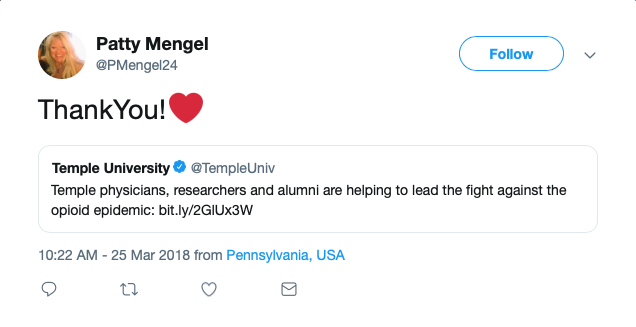

Second, 17,596 tweets were dropped whose text was identical to the text of an
earlier tweet in the data _from the same user_. Duplicate tweets _across users_
were kept because if the same news story with a stigmatizing headline is shared
via tweet by multiple users, I wanted to count each tweet in my analysis.

Third, since the ultimate goal is to measure how stigma varies within the
United States, 221,828 tweets were dropped if the user's self-entered location
could not be mapped to a U.S. state. In order to capture as many tweets as
possible, the user location field was examined to see if it ended in a postal
abbreviation, contained a state name, or contained the name of city with a
population over 100,000.

At the end of this cleaning, 149,056 unique tweets with opioid keywords and
user location mapped to a U.S. state remained. As can be seen in Table 2 below,
these tweets average 141 characters in length. This is exactly half of the
maximum character length allowed by Twitter of 280.

### Table 2: Analysis of Tweet Character Length
**Statistic**           
-------------------------  -----------
Mean                       141.30      
Median                     130.00
Standard Deviation         71.37   
Minimum                    8    
Max                        281      

## Exploratory Visualization

Before selecting a sample of these tweets for manual coding, it is useful to
analyze which keywords that were used to filter tweets via the streaming API
appear most frequently in the data. Although the list of keywords to track
included 27 opioid-related terms, a large majority of tweets contain one of
just four keywords: opioid, heroin, overdose, and fentanyl. This breakdown is
visualized in Figure 4. Note that percentages sum to more than 100 because
tweets can contain multiple keywords.

### Figure 4: Most Popular Track Terms
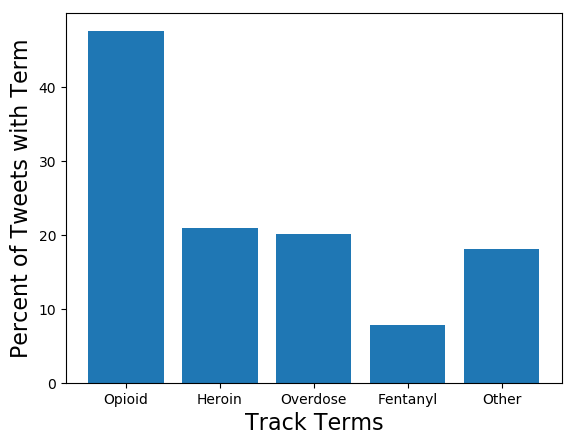

## Algorithms and Techniques
In order to create a custom classifier capable of automatically coding a large
dataset, I followed the examples of Baum et al. 2018 and Oscar et al. 2017 and
manually coded a small sample to use as training data for supervised machine
learning algorithms [6,7]. The qualitative coding instrument was developed with
reference to the academic literature and in consultation with two practitioners
with significant experience addressing opioid-related stigma. (See
Appendix: Qualitative Coding Instrument.)

Five supervised learning algorithms were trained and evaluated on the manually
coded data: Logistic Regression, Linear Support Vector Machine, Naïve Bayes,
AdaBoost, and a Convolutional Neural Network (CNN).

1. Logistics Regression or Logit, will be used as a second benchmark algorithm
in addition to the Simple Majority Classifier discussed in the **Benchmark
Model** section below. Logit is one of the most efficient algorithms, requires
little tuning, and performs relatively well on binary classification tasks [8].
Additionally, since Logit returns the probability that an observation is in a
given class, it is a good choice in settings where you want to be able to
customize the threshold (for example if there is a need for high precision or
high recall) [8]. Logistic regression works by finding the parameters $\beta$
that fit the following equation:
$$ y = \begin{cases} 1 & \beta_0 + \beta_1 x + \varepsilon > 0 \\ 0 & \text
{else} \end{cases} $$
In this equation, $\varepsilon$ represents an error term with a distribution
matching the standard logistic distribution [9]. Although there is only one
$\beta$ and one $x$ in the equation above, in our case it will
actually be a vector of weights and a vector of features.

2. Prior to the resurgence of deep learning, Support Vector Machines (SVMs)
were considered state-of-the-art for text classification [10]. They are well
suited to text classification because of their ability to deal with lots of
features [8]. I will be using linear kernel since, for text classification, it
has been shown to perform as well as non-linear kernels [11]. Support Vector
Machines work in classification tasks by trying to find the combinations of
features that do the best job of creating separate categories. Mathematically,
this is done by fitting a maximally-separating hyperplane to the feature
space [6]. This is illustrated conceptually in Figure 5 which shows a mapping
from the input space to a (higher-dimensional) feature space where the
hyperplane that maximizes the margin between the two classes is calculated.

### Figure 5: Conceptual Illustration of SVMs from from Schölkopf and Smola (2002) [12]
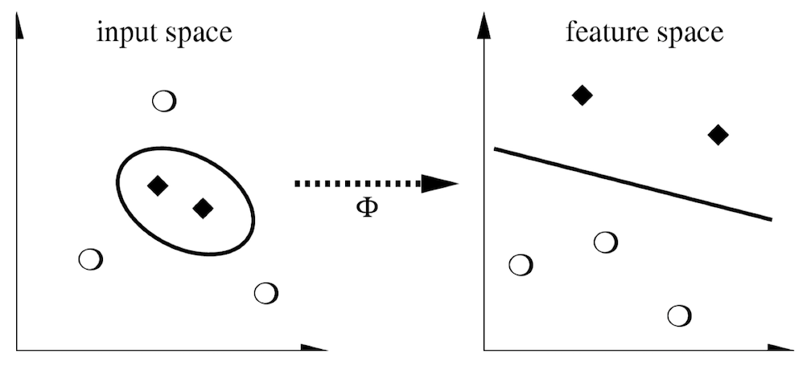

3. Naïve Bayes is popular as a baseline model for text classification since it
trains quickly, requires little tuning, and is less of a black box than other
algorithms. With additional pre-processing of text data, such as the TF-IDF
weighting process discussed in the **Data Preprocessing** section below, Naïve
Bayes achieve results competitive with SVMs [10]. The specific implementation
of Naïve Bayes used is the multinomial Naïve Bayes classifier, which is well
suited to text classification based on word counts. There is only a single
hyperparameter to tune, alpha, which is an additive smoothing parameter. The
algorithm works by looks at the different words present in a tweet and
"naïvely" assuming that they _independently_ contribute to the probability that
the tweet contains stigmatizing language. Mathematically, this is calculated
as:
$$ p(C_k | x_1, \dots, x_n) = p(C_k) \prod_{i=1}^n p(x_i | C_k) $$
In our case, this is interpreted as the probability a tweet contains
stigmatizing language (that is, belongs to class $C$), given the vector of text
features $x_1$ through $x_n$, is equal to the probability a tweet contains
stigmatizing language (the prior probability) times the joint probability of
a tweet containing these features given that it is stigmatizing.

4. AdaBoost is an example of a boosting model, one that combines a number of
rough "rules of thumb" to create a highly accurate overall rule [13]. It has
been shown to frequently outperform other non-deep learning algorithms,
including on text classification tasks[14]. Adaboost trains by first generating
a rough rule of thumb and then assigning it a weight based on how much better
than random guessing it is [13]. Adaboost then adjusts the raw data, placing
more emphasis on the exceptions to the first rule and looks for another rule of
thumb that can explain those [13] This is a key difference compared to bagging
models which generate rough rules of thumb by training on repeated random
bootstrap samples of the data. This process is then repeated for a number of
rounds. After training has been completed, AbaBoost generates predictions by
looking at new data, considering all the rough rules of thumb that have been
generated, and taking a "majority vote", with more emphasis given to those
rules that were assigned a higher weight during training. The pseudo code for
this is shown in Figure 6.

### Figure 6: AdaBoost algorithm from Schapire 2013 [15]
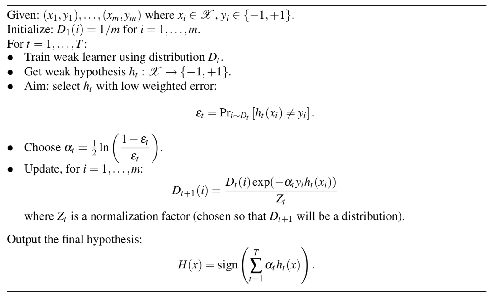

5. CNNs are now considered state-of-the-art for classification tasks, although
they require large amounts of training data, which was not possible in this
case due to the manual coding requirement. With sufficient data,
CNNs can learn complex features that allow them to excel at natural
language processing tasks [16, 17]. Like all deep neural networks, CNNs
take input in the form of vectors, apply operations and feed results forward
through a series of hidden layers, before connecting to a final layer that
outputs predictions, in this case, text classifications. The hidden layers in a
CNN typically alternate between convolutional layers and pooling layers, as can
be seen in the example architecture in Figure 7. Within each convolutional
layer, a filter slides over the input to extract a feature map. The
dimensionality of this feature map is then reduced by the pooling layer.
Finally, a fully connected layer uses the pooled feature maps to output
classification predictions.

### Figure 7: CNN Architecture from Albelwi & Mahmood 2017 [18]


## Benchmark Model

One of the challenges in creating a custom classifier is the lack of a
benchmark model. Following the example of Oscar et al. 2017, I initially
compare the results of my classifier with the predictions of a simple majority
classifier (also known as the Zero Rule or ZeroR classifier) [6]. Since a
majority of tweets do not contain stigmatizing content, the simple majority
classifier predicts that all tweets do not contain stigmatizing content.

Only 7.2% of the manually coded test examples contained stigmatizing language,
meaning that the simple majority classifier achieved 92.8% accuracy. However,
since the simple majority classifier did not predict any true values, its
F-1 score was zero, as explained in the **Evaluation Metrics** section above.

As an additional benchmark, I use the relatively simple Logistic Regression
algorithm with L1 regularization since the features are sparse. Its
performance is discussed in the **Results** section below.

# Methodology

## Data Preprocessing
After filtering the data as described in **Data Exploration**, the
following additional preprocessing steps were implemented:

1. Remove links, @mentions, and HTML to improve readability for manual coding.
2. Manually code training data sample and resolve inter-coder disagreements.
3. Normalize text by stripping special characters, expanding contractions,
changing case to lowercase, removing stopwords, tokenizing (converting
sentence to a list of individual words), and lemmatizing (converting each word
to its root form to reduce dimensionality).
4. For the non-neural network algorithms, transform the normalized data to a
matrix of word counts using a term-frequency times inverse document-frequency 
(tf-idf) weighting. This weighting re-balances to give more influence to rare
words and less influence to common words. It has been shown to improve the
performance of Naïve Bayes in particular [8].
5. For the CNN, transform the normalized data to arrays knowns as tensors 
(since CNNs require arrays rather than matrices).

During step 2, I coded all 1,000 training examples and then had a second coder
independently code a random subsample of 100 training examples. On these 100
examples, we agreed on the classification in 94% of cases, which is a more than
satisfactory level of inter-coder reliability by the standards of the
literature. In order to reduce the risk of false positives, where coders
disagreed about whether a tweet contains stigmatizing language, the final
training set coded that tweet as not containing stigmatizing language.

## Implementation
Once the preprocessing had been implemented, a training and testing pipeline
was developed. The manually coded data was randomly shuffled and split into 750
training examples and a hold-out set of 250 examples for testing. Since the
labels were highly imbalanced with only 7.2% of tweets coded as containing
stigmatizing language, the data was split in a stratified fashion.

Each of the classifiers were trained on the training examples and then
evaluated on the hold-out set. The following specifications were used for each
classifier:

1. Logistic Regression with L1 penalty, tolerance for stopping criteria of
0.001, and liblinear solver
2. Linear Support Vector Classifier with L1 penalty, tolerance for stopping
criteria of 0.001, and primal optimization solver
3. Multinomial Naïve Bayes with additive smoothing parameter of 0.01
4. AdaBoost Classifier with scikit-learn default parameters
5. spaCy Text Categorizer Neural Network trained over 20 iterations using
minibatches starting at 4 examples and increasing by a factor of 1.001. The
only parameter different from the defaults in spaCy's documentation was the use
of a decaying, rather than fixed, dropout rate that started at 0.25 and decayed
by a factor of 0.01 to 0.20. Although spaCy's architecture has not been
published yet, details of the model are described in their API documentation 
[19] and the implementation can be replicated by following their guide to
training a text classification model [20].

Thanks to guides from scikit-learn [21] and spaCy [20], implementation was
relatively straightforward. The biggest complications involved figuring out how
to adapt example code to the specifics of my custom data set.

The initial performance of each classifier is listed in Table 3 below. As
predicted, the Simple Majority Classifier achieves a high level of accuracy but
receives an F-1 score of zero. The classifier that performs best in terms of
both accuracy and F-1 score was the Multinomial Naïve Bayes classifier.

### Table 3: Initial Implementation Performance
**Classifier**                 **Accuracy**   **F-1 score**
-----------------------------  ------------   -------------
Simple Majority Classifier      0.928          0.000
Logistic Regression             0.924          0.240
Linear Support Vector Machine   0.924          0.296
Multinomial Naïve Bayes         0.944          0.364
AdaBoost                        0.924          0.345
spaCy Text Classifier CNN       0.924          0.240     
-----------------------------  ------------   -------------

## Refinement
After the initial implementation, the Naïve Bayes classifier was chosen for
further refinement since, in addition to achieving the best performance, it is
fast to train and relatively simple to understand compared to next highest
performing algorithm, AdaBoost, which is more of "black box."

This classifier was further refined by using a grid search with five-fold cross
validation to confirm the optimal level of the additive smoothing parameter
alpha. The values of alpha considered included 1.0, 0.1, 0.01, and 0.001.
Compared the the unoptimized model (alpha = 1) which has an F-1 score of
0, the optimized model (alpha = 0.01) has an F-1 score of 0.36.

# Results

## Model Evaluation and Validation
As mentioned above, the refined version of the final model is a Multinominal
Naïve Bayes Classifier with an adaptive smoothing parameter of 0.01. The
robustness of the model was validated by looking at a sample of predictions
made when auto-coding the data that was not selected for manual coding. As can
be seen in Figures 8 and 9, these predictions have a high degree of accuracy.

### Figure 8: Tweets Coded as Non-Stigmatizing
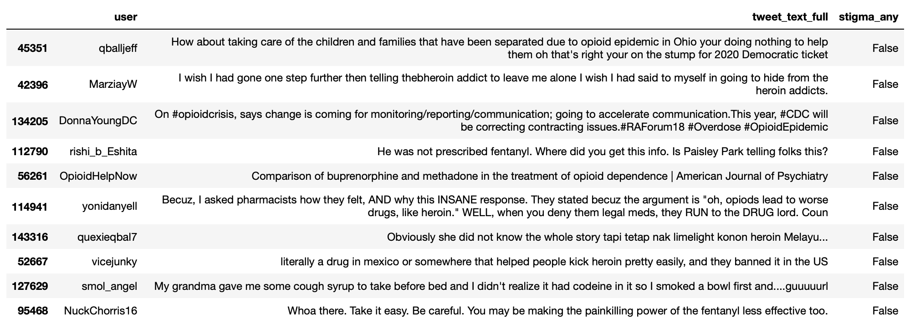

### Figure 9: Tweets Coded as Stigmatizing
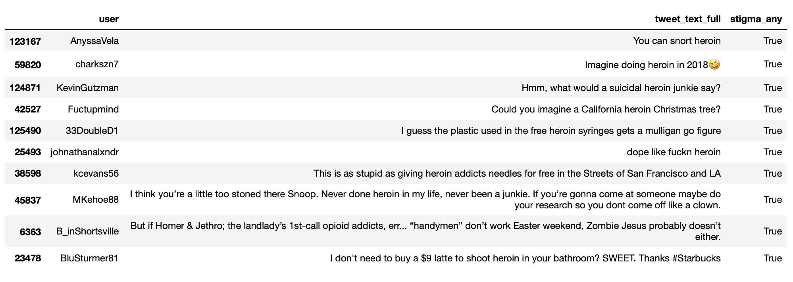

Of the 10 sample tweets coded as non-stigmatizing, there only appears to be one
false negative. The tweet from user MarziayW, clearly uses language referring
to individuals with substance use disorder as "addicts," however, the
classifier might have been confused by a spelling error ("thebheroin" instead
of "the heroin").

Of the 10 sample tweets coded as stigmatizing, there seem to potentially be
four false positives (from users AnyssaVela, charkszn7, Fuctupmind, and
johnathanalxndr). Yet, considering the sparsity of positives in the training
data, the fact that the classifier was able to pick out so many clear examples
of stigmatizing language is impressive.

## Justification
The final model achieves slightly higher accuracy (94.4%) and a
significantly higher F-1 score (0.36) than the simple majority classifier 
(accuracy: 92.8%, F-1 score: 0.00) or the logistic regression (accuracy: 92.4%,
F-1 score: 0.24). Additionally, inspection of a small sample of predictions
made by the classifier indicates that it is generally able to distinguish
stigmatizing language, though in this small sample the level of precision left
a little to be desired.

# Conclusion

## Free-Form Visualization
At the beginning, I set out to measure geographic variation in opioid-related
stigma. Figure 10 below presents one proxy measure based on tweets classified
by the algorithm trained in this project. States with a greater percentage of
tweets classified as stigmatizing are shaded darker. 

### Figure 10: Percent of Tweets Containing Stigmatizing Language by State
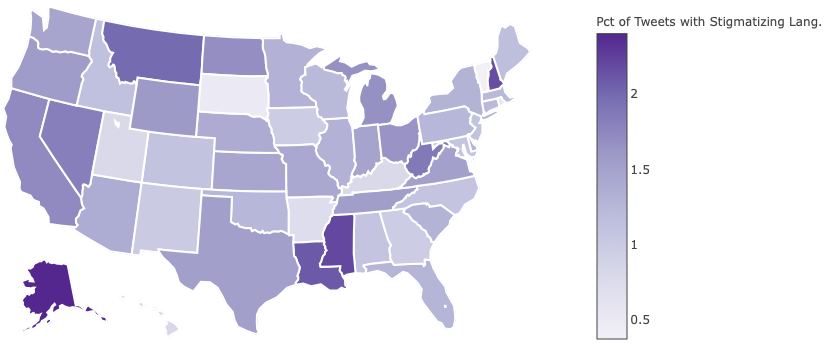

Although visualizing how stigma varies geographically answers an interesting
descriptive question, the questions that are most important for policy are
causal questions. Of particular importance is the question of whether increased
opioid-related stigma _causes_ increased overdose deaths. Unfortunately, these
more important questions are also more difficult to answer. However, the new
descriptive data generated by this project allows at least an initial
exploration of whether stigma is _correlated_ with overdose deaths.

Figures 11 and 12 analyze the relationship between the prevalence of stigma
measured in tweets and the rate of overdose deaths due to opioids in 2016 (the
most recent year for which data is available). States in the bottom three
quartiles in terms of overdose rates (Figure 11) are examined separately from
states in the top quartile (Figure 12). While Figure 11 indicates there is no
relationship between stigma and overdose deaths for states in the bottom three
quartiles in terms of overdose deaths, Figure 12 suggests that there is a
relatively strong positive relationship between stigma and overdose deaths for
the states with the highest level of overdose deaths.

### Figure 11: Opioid Overdoses (2016) vs Tweet Stigma: Bottom 75%
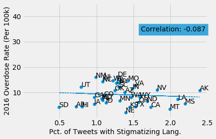

### Figure 12: Opioid Overdoses (2016) vs Tweet Stigma: Top 25%
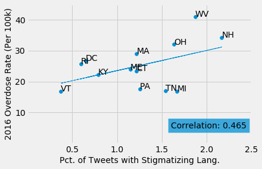

\newpage
There are a number of caveats to emphasize here:

1. The relationship in Figure 12 is just a correlation. Instead of stigma
causing more overdose deaths, it could be that more overdose deaths lead to
more stigmatized views of individuals with opioid-use disorder.
2. The relationship is sensitive to the choice of criteria for which states to
include. If only states above the 80th percentile in terms of overdose deaths
are included, the correlation rises to 0.51. However, if all states above the
60th percentile in terms of overdose deaths are included, the correlation
coefficient drops to 0.36. And if all states above the 50th percentile in terms
of overdose deaths are included, it drops further to 0.28.
3. Overdose data from the summer of 2018, once available, might show a
different relationship. There have been elements of continuity in the epidemic
but it has also been fast-moving with some areas seeing rapid increases in
overdose deaths, especially with the arrival of fentanyl.
4. As a result of the low prevalence of stigmatizing tweets, many states have
very few tweets coded as containing stigmatizing language. Although the median
number of total tweets per state is 1,612, the median number of tweets coded as
stigmatizing is 22. This may mean that there is not enough data to detect
significant differences in stigma between smaller states.
5. Correctly coding tweets for stigmatizing language is a hard NLP problem and,
partially as a result of the relatively small size of the training data, the
classifier ultimately used to auto-code the vast majority of the data had lots
of room for improvement in terms of precision and recall.
6. Stigma as measured through Twitter conversations may not be reflective of
stigma either among the general population or among the populations that
interact most with individuals with substance use disorder.

Yet, even with all these caveats, Figure 12 provides enough evidence to at
least justify gathering more data and conducting additional research to better
understand the relationship between stigma and overdose deaths. 4,123 lives
could have been saved in 2016 if all the states in the top quartile in terms of
overdose death rates were able to reduce their overdose rates to the level of
Vermont, the state with the lowest measured levels of stigma not only among the
top quartile but among all states. Although we cannot be sure whether reducing
stigma to Vermont levels would also reduce overdose rates to Vermont levels 
(or if it is even possible to reduce stigma on a statewide level), the scale of
the potential benefits from doing so suggests that these are questions worth
exploring further.

## Reflection
The process for this project can be summarized in the following steps:

1. Gather data from non-traditional source in order to fill gap
2. Clean and preprocess data
3. Develop a qualitative coding instrument and manually code training set
4. Train and evaluate classifiers
5. Refine best performing classifier and auto-code remaining data
6. Analyze results

This process reinforced for me the lesson that getting data that is ready to go
into machine learning algorithms is 99% of the work. In the first two steps, I
learned a significant amount about how to deal with messy, real-world,
relatively large data sets. And unrelated to machine learning and data science
per se, I also learned a great deal about the opioid epidemic and stigma
towards individuals with substance use disorder. Although the classifier I developed is admittedly imperfect, the problem of the opioid epidemic is too significant to let perfect be the enemy of good when it comes to gathering data that could inform evidence-based policies.

## Improvement
In future, I would like to continue to collect data so that I can eventually
compare historical tweets with contemporary data on overdose deaths. I would
also like to crowd-source help with manual coding in order to build a larger
training dataset that could be used to take advantage of deep learning
techniques. Finally, I am eager to receive feedback from individuals working on
the front lines of the epidemic about how my coding instrument could be
improved and, most importantly, what other data could be collected that may
help save lives.

# References

1. Seth, P., Scholl, L., Rudd, R.A., Bacon, S. (2018). Overdose Deaths
Involving Opioids, Cocaine, and Psychostimulants — United States, 2015–2016.
MMWR Morb Mortal Wkly Rep 67, 349–358.
2. Xu, J., Murphy, S. L., Kochanek, K.D., Bastian, B., & Arias, E. (2018).
Deaths: Final Data for 2016. National Vital Statistics Reports, 67(5).
Hyattsville, MD: National Center for Health Statistics.
3. Sordo, L., Barrio, G., Bravo, M. J., Indave, B. I., Degenhardt, L.,
Wiessing, L., Ferri, M., & Pastor-Barriuso, R. (2017). Mortality risk during
and after opioid substitution treatment: systematic review and meta-analysis of
cohort studies. The BMJ, 357, j1550.
4. Olsen Y., & Sharfstein, J. M. (2014). Confronting the Stigma of Opioid Use
Disorder and its Treatment. JAMA, 311(14), 1393–1394.
5. Kennedy-Hendricks, A., Barry, C. L., Gollust, S. E., Ensminger, M. E.,
Chisolm, M. S., & McGinty, E. E. (2017). Social Stigma Toward Persons with
Prescription Opioid Use Disorder: Associations with Public Support for Punitive
and Public Health–oriented Policies. Psychiatric Services, 68(5), 462-469.
6. Baum, M. A., Cohen, D. K., & Zhukov, Y. M. (2018). Does Rape Culture Predict
Rape? Evidence from U.S. Newspapers, 2000-2013. Quarterly Journal of Political
Science, 13(3), 263-289.
7. Oscar, N., Fox, P. A., Croucher, R., Wernick, R., Keune, J., & Hooker, K. 
(2017). Machine Learning, Sentiment Analysis, and Tweets: An Examination of
Alzheimer’s Disease Stigma on Twitter. Journals of Gerontology Series B:
Psychological Sciences and Social Sciences, 72(5), 742-751.
8. Sachan, L. "Logistic Regression vs Decision Trees vs SVM: Part II." Edvancer Eduventures. 6 October 2015. Web. Accessed 25 June 2018.
9. Wikipedia. Logistic Regression. Retrieved from
https://en.wikipedia.org/wiki/Logistic_regression
10. Rennie, J. D., Shih, L., Teevan, J., & Karger, D. R. (2003). Tackling the
Poor Assumptions Of Naïve Bayes Text Classifiers. Proceedings of the 20th
International Conference On Machine Learning, 616-623.
11. Yang, Y., & Liu, X. (1999). A re-examination of text categorization
methods. Proceedings of SIGIR ’99.
12. Schölkopf, B., & Smola, A. (2002). Support Vector Machines and Kernel
Algorithms. http://alex.smola.org/papers/2002/SchSmo02b.pdf
13. Freund, Y., Schapire, R., & Abe, N. (1999). A Short Introduction to
Boosting. Journal-Japanese Society For Artificial Intelligence, 14(771-780), 1612.
14. Schapire, R. E. (2007). Theory and Applications of Boosting. Presentation
at Twenty-First Annual Conference on Neural Information Processing Systems.
Vancouver, Canada.
15. Schapire, R. E. (2013). "Explaining AdaBoost". In Schölkopf, B., Luo, Z., &
Vovk, V. Eds., Empirical Inference: Festschrift in Honor of Vladimir N. Vapnik, Springer.
16. Kim, Y. Convolutional neural networks for sentence classification. arXiv
2014, arXiv:1408.5882.
17. Conneau, A.; Schwenk, H.; LeCun, Y.; Barrault, L. Very deep convolutional
networks for text classification. arXiv 2016, arXiv:1606.01781.
18. Albelwi, S., & Mahmood, A. (2017). A Framework for Designing the
Architectures of Deep Convolutional Neural Networks. Entropy, 19(6), 242.
19. spaCy. TextCategorizer API. Retrieved from  
https://spacy.io/api/textcategorizer
20.  spaCy. Training a text classification model. Retrieved from
https://spacy.io/usage/training#section-textcat
21. scikit-learn. Classification of text documents using sparse features.
Retrieved from:
https://scikit-learn.org/stable/auto_examples/text/plot_document_classification_20newsgroups.html

\newpage
# Appendix: Qualitative Coding Instrument
Based on a review of the literature about opioid-related stigma, the following
instrument was developed to code tweets for language that perpetuates
stigmatized views of individuals with substance use disorder and medications
for addiction treatment.

**Stigmatized views of individuals with substance use disorder (SUD)**

Does the tweet make reference to any of the following? Check as many as apply.

- Addiction as a choice or result of character flaw (such as immorality, stupidity, weakness)
- Addiction as a sign of poor parenting
- “Clean” to refer to people in recovery
- Individuals with SUD are abusers, addicts, druggies, or junkies (include self-labeling)
- Individuals with SUD are not desirable as neighbors or community members
- Individuals with SUD are not worth saving or deserve to die (e.g. “natural selection”)
- Individuals with SUD are not worth spending money on
- Individuals with SUD are violent/dangerous
- Opioid epidemic is not a problem, is exaggerated, or is something to joke about
- Other: [...]

**Stigmatized view of medications for addiction treatment (MAT)**

Does the tweet make reference to any of the following? Check as many as apply.

- Abstinence as more admirable than maintenance with medication
- Advocating criminal justice approach over public health approach
- “Clean/dirty” to refer to negative/positive toxicology results (exclude references to dirty needles)
- “Detoxification” from medication (buprenorphine/Suboxone or methadone)
- Individuals receiving MAT should not be pregnant or parents
- Injection sites as “drug dens”
- Providers of MAT as drug dealers
- MAT as an addiction or substitution
- MAT as harmful
- Treatment as hopeless
- Other: [...]
